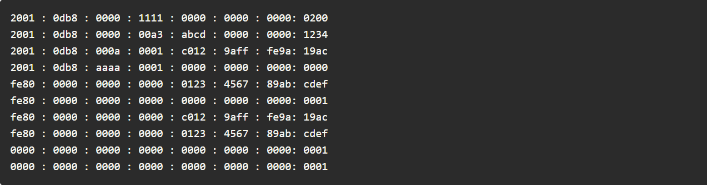

# IPV6 Addressing

## Hexadecimal Number System

- Base 16 number system
- Uses **numbers 0 - 9** and **alphabets A - F**
- **0 1 2 3 4 5 6 7 8 9 A B C D E F**
- In IPv6 addresses, these 16 digits are represented as **hextets** (discussed next) allowing us to represent these massive addresses in a much more readable format

## IPV6 Addressing Formats

- IPV6 are written as a string of hexadecimals
- 128 bits length
- Every 4 bits represented by a single hexadecimal digit (total 32 hexadecimal values)
- Not case sensitive
- Can be written in uppercase and lowercase

---

---

## Preferred Format

- Preferred format for writing an IPv6 address is **x : x : x : x : x : x : x : x**, with each **x** consisting of four hexadecimal values
- In IPv6, a hextet is the unofficial term used to refer to a segment of 16 bits, or four hexadecimal values
- Each **x** is a single hextet which is 16 bits or four hexadecimal digits
- Preferred format means that you write IPv6 address using all 32 hexadecimal digits
- It does not necessarily mean that it is the ideal method for representing the IPv6 address

---

---

## IPV6 Formatting Rules

### Rule 1 - Omit Leading 0's

---

---

### Rule 2 - The Double Colon ::

---

---

- ### Solving for Two consecutive 0 strings in two seperate spaces

---

---

