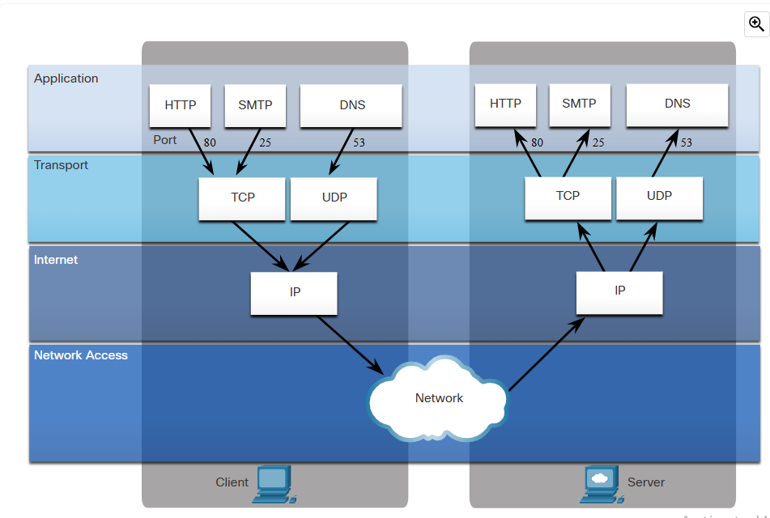

# Port Numbers

## Transport Layer Port Number

- TCP/UDP ports at transport layer enables the devices to open many different services at the same time
- Port numbers below 1024 are called well known ports
    - For e.g, 
        - 80 -> Web Server
        - 21 -> FTP
        - 25 -> Mail Server
    - Well-known ports are automatically identified by the client
- Ports enable us to run many different services on the web server
- Host ports for TCP/UDP are dynamically assigned above 1024
- For e.g, A client wants to access a web browser
    - The host picks up a TCP port
    - At Transport Layer
        - Destination port => 80 (Web Server)
        - Source port => 5305 (Randomly assigned)
    - The web server gives response back
        - Destination port => 5305
        - Source port => 80

#### Ports

-  A port is a numeric identifier within each segment that is used to keep track of specific conversations between a client and server
- Every message that a host sends contains both a source and destination port
- When a message is delivered using either TCP or UDP, the protocols and services requested are identified by a port number

---

---

## TCP And UDP Port Number

- Ports are assigned and managed by **Internet Corporation For Assigned Name And Numbers (ICANN)**
- Ports can be broken into three categories and range in no from 1 to 65,535
    - **Well Known ports:** 
        - Ports associated with common network applications
        - Ports: 1 to 1023

    - **Registered Ports:**
        - Used by organisation to register specific application like IM applications
        - Ports: 1024 to 49151

    - **Private Ports:**
        - Often used as source ports
        - Can be used by any application
        - Ports: 49152 65535

- Some applications may use both TCP and UDP. For example, DNS uses UDP when clients send requests to a DNS server
- However, communication between two DNS servers always uses TCP

## Socket Pairs

- The source and destination ports are placed within the segment
- The segments are then encapsulated within an IP packet
- The IP packet contains the IP address of the source and destination
- The combination of the source IP address and source port number, or the destination IP address and destination port number is known as a socket

## Netstat Command

- Netstat command displays
    - The protocols in use
    - The local address and port numbers
    - The foreign address and port numbers
    - The connection state

- By default, the netstat command will attempt to resolve IP addresses to domain names and port numbers to well-known applications
- The -n option can be used to display IP addresses and port numbers in their numerical form