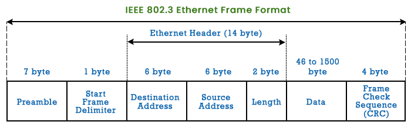

# Encapsulation And Ethernet Frames

- Ethernet technology commonly used in LAN
- Devices access the Ethernet LAN through **Network Interface Card (NIC)**
- Ethernet is for Network Interface Card to Network Interface Card on the same network
- Each Ethernet NIC has a unique address permanently embedded on the card known as **Media Access Control (MAC) address**

## Encapsulation

- Process of wrapping data with necessary prototcol information before being transmitted over the network

- Each msg is encapsulated in a specific format called frame

- **Format and content of frame** are determined by
    - The type of msg sent 
    - The channel over which it is communicated

## Ethernet Frame

- An ethernet frame is a data packet on OSI layer 2 (Data Link layer) used in ethernet networks for reliable communication in same local networks (LAN)
- It wraps the data with headers and trailers for delivery

- #### De Encapsualtion
    - Process of reversing the encapsulation to extract the data


### Structure




- #### Preamble
    - Helps synchronize signal between sender and receiver

- #### Start Frame Delimitter
    - Indicates to the destination NIC that actual information is to be started after this
    - Marks start of actual frame

- #### Destination MAC Address
    - MAC address of the destination NIC on that network

- #### Source MAC Address
    - MAC address of the source NIC on that network

- #### Length/Type
    - This can be 
        - Either the size of data 
        - Or the type of data (like IPV4 data packet or IPV6 data packet)

- #### Data
    - Actual encapsulated data (IPV4 packet Or IPV6 packet) with protocols attached (TCP, HTTP etc..)

- #### Frame Check Sequence 
    - To check if there were any errors during data transmission


```

IP is responsible for sending a msg from msg source to destination over one or more networks

```

