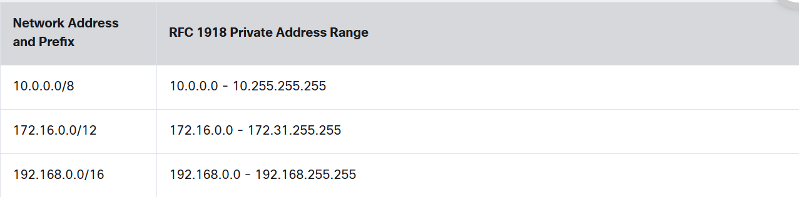

# Types Of IPV4 Addresses

## Public IPV4 Addresses

- Routable on the internet
- Assigned by ISPs
- Unique globally
- Used for internet facing devices

## Private IPV4 Addresses

- Not used on the internet
- Used by organisations to assign IPV4 addresses to internal hosts
- Reusable accross different organisations
- Introduced in mid 1990's due to IPV4 exhaustion

---

---

**Notes:**
- The long term solution for IPV4 address depletion was IPV6
- Private addresses are defined in **RFC 1918** and sometimes refereed as RFC 1918 address space

## Routing To The Internet

- Private addresses are not routable across the internet
- So if a host with private address sends a msg to a public address then
    - Packet with private IPV4 address must be filtered (discarded)
    - Or translated to a Public IPV4 address befor forwarding teh packet to an ISP
        - **NAT (Network Address Translation)** converts these private addresses to public addresses on the router

## Special Use IPV4 Addresses

- ### Loopback Addresses    
    - These are special addresses used by a host to direct traffic to itself 
    - For example, the ping command is commonly used to test connections to other hosts
    - You can also use the ping command to test if the IP configuration on your own device
    - **127.0.0.0 /8 or 127.0.0.1 to 127.255.255.254**
    - More commonly identified as **127.0.0.1**

- ### Link Local Addresses
    - Assigned automatically by Windows clients when they cannot obtain an IP from a DHCP server or other configuration methods
    - **169.254.0.0 /16 or 169.254.0.1 to 169.254.255.254**
    - More commonly known as **Automatic Private IP Addressing (APIPA)**
    -  Can be used in a peer-to-peer connection but are not commonly used for this purpose.

## Legacy Classful Addressing

- IPV4 Addresses assigned using **RFC 790**
- Customers were allocated network addresses based on one of three classes **A, B or C**
- The RFC divided the unicast ranges into specific classes as follows:

    - #### Class A (0.0.0.0/8 to 127.0.0.0/8)
        - Designed to support large networks with ore than ~16 million hosts
        - Used prefix /8 
            - First octet -> **Network part**
            - Remaining octet -> **Host part** (more than 16 million host addresses per network)
            - **In simpler words to say they had subnet mask : 255.0.0.0**

    - #### Class B (128.0.0.0 /16 - 191.255.0.0 /16)
        - For medium to large networks
        - Upto 65,000 host addresses
        - Used prefix /16
            - First and second octet -> **Network part**
            - Remaining two octets -> **Host part**
            - **Subnet mask: 255.255.0.0**

    - #### Class C (192.0.0.0 /24 - 223.255.255.0 /24)
        - For small networks 
        - Upto 254 hosts
        - Used prefix /24
            - First three octets -> **Network part**
            - Last Octet -> **Host part**
            - **Subnet Mask: 255.255.255.0**

    - #### Note: There is also a Class D multicast block consisting of 224.0.0.0 to 239.0.0.0 and a Class E experimental address block consisting of 240.0.0.0 - 255.0.0.0.

- In the mid-1990s, with the introduction of the World Wide Web (WWW)
    - Classful addressing was deprecated to more efficiently allocate the limited IPv4 address space
    - Classful address allocation was replaced with classless addressing, which is used today
    - Classless addressing ignores the rules of classes (A, B, C)
    - Public IPv4 network addresses (network addresses and subnet masks) are allocated based on the number of addresses that can be justified.

## Assignment Of IP Addresses

- Both IPV4 and IPV6 are managed by **Internet Assigned Numbers Authority (IANA)**
- IANA manages and allocates blocks of IP addresses to **Regional Internet Registries (RIRs)**
- RIRs are responsible for allocating IP addresses to ISPs who provide IPv4 address blocks to organizations and smaller ISPs
- Organizations can also get their addresses directly from an RIR (subject to the policies of that RIR).

- #### Regional Internet Registries

    - **AfriNIC (African Network Information Center)** -> Africa Region
    - **APNIC (Asia Pacific Network Information Center)** -> Asia / Pacific Region
    - **ARIN (American Registry For Internet Numbers)** -> North America Region
    - **LACNIC (Regional Latin - America And Carribean IP Address Registry)** -> Latin America and some Carribean Islands
    - **RIPE NCC (Réseaux IP Européens Network Coordination Centre)** -> Europe, the Middle East, and Central Asia

